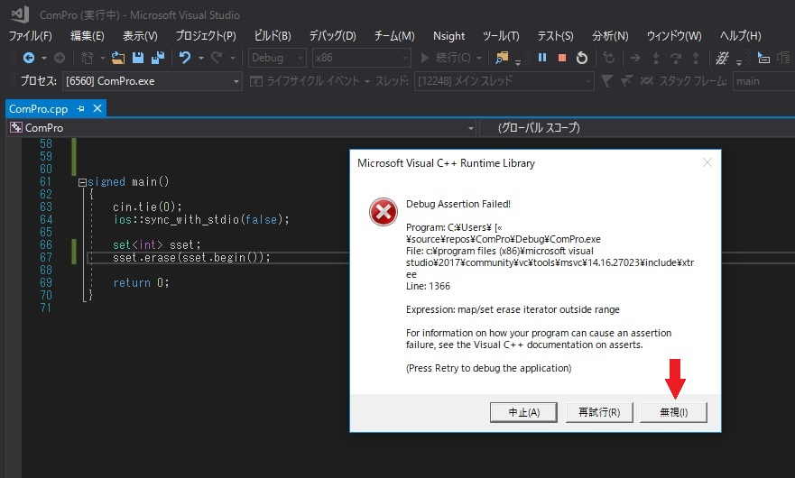
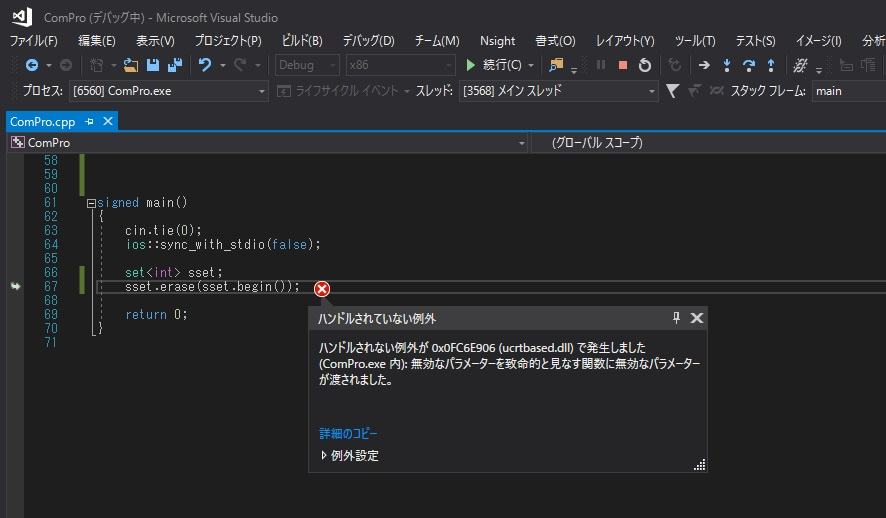

# パソコン甲子園・情報オリンピック（競技プログラミング）ガイドライン

 

## 0. はじめのはじめに

- あんなん真面目にやる気ねぇよって人はそっ閉じして、どうぞ。
- 高専プロコンやETロボコン等で仕事を任されているならそっちを優先しましょう。
- パソコン甲子園・情報オリンピック対策の参考資料がほとんどなく、主観で記述した部分もいくつかあるため、あくまで参考程度に。

 

 

## 1. はじめに

- パソコン甲子園（プログラミング部門）や情報オリンピックのようなプログラムの問題を解いて順位を競うようなプログラミングコンテストを**競技プログラミング（競プロ）**と言います。

- 以下では対策を行っていくうえで、**AtCoder**と**AOJ**というサービスを活用します。とりあえず両方アカウント作成しておきましょう。

   

  - [AtCoder](https://atcoder.jp/) （初めての人はログイン後、**[Practice](https://atcoder.jp/contests/practice) のA問題**を解いて雰囲気をつかんでください）
  - [AOJ](http://judge.u-aizu.ac.jp/onlinejudge/) 
  - [AOJ-PCK（パソコン甲子園過去問）](http://aoj-pck.vsw.jp/) （ブラウザによってはうまく表示されないぽい？）
  - [AOJ/AtCoder-JOI（情報オリンピック過去問）](https://joi.goodbaton.com/) 

   

- 競プロ、AtCoderに純粋に興味がある人は以下参考

  - [勉強か？趣味か？人生か？─プログラミングコンテストとは](https://www.slideshare.net/iwiwi/wakate-web-14323842)
  - [レッドコーダーが教える、競プロ・AtCoder上達のガイドライン](https://qiita.com/e869120/items/f1c6f98364d1443148b3)
  - [AtCoderに登録したら次にやること～これだけ解けば十分闘える！過去問精選10問～](https://qiita.com/drken/items/fd4e5e3630d0f5859067)
  - [AtCoder（競技プログラミング）の色・ランクと実力評価、問題例](http://chokudai.hatenablog.com/entry/2019/02/11/155904)

 

 

## 2. 参考サイト

　上記サイトに加え、以下

　- [パソコン甲子園 プログラミング部門 予選の傾向と対策](https://www.hamayanhamayan.com/entry/2018/10/01/014322)

 

 

## 3. レベル1（予選突破まではいかなくとも健闘したい人向け）- AtCoderレート：灰、茶相当

### 全般

- オンラインジャッジの提出結果の意味

  - **AC（Accepted）**

    正解！！　次の問題に進みましょう。

  - **CE（Compile Error）**

    コンパイルエラー。文法にミスがないか、提出ページでの言語選択を間違っていないか等確認しましょう。

  - **RE（Runtime Error）**

    実行時エラー。原因は様々あります。よくある原因は配列サイズ不足や0除算などなど。デバッグ機能を活用しつつ原因を探りましょう。

  - **WA（Wrong Answer）**

    純粋に出力結果が間違っています。解法に穴がなかったか改めて考え直してみましょう。

  - **TLE（Time Limit Exceeded）**

    実行制限時間超過。計算量が多すぎて制限時間内に計算が終了しなかった場合に表示されます。基本的に**1秒当たりの計算量（専らループ回数）の上限は108回**です。計算量を削減できないか改めて解法を考え直してみましょう。

  - **MLE（Memory Limit Exceeded）**

    メモリ制限超過。膨大なサイズの配列（**int型で約107以上？**）を宣言したりすると表示される場合があります。無駄に配列サイズを大きくしていないか、配列を再利用できないか等、改めて考え直してみましょう。

 

- C言語

  **配列、多次元配列、if文、for文、多重for文、while文、文字列等**の知識が必要

  また、以下のヘッダファイルの存在も知っておくこと

  - **<stdio.h>** ：入出力関数（printf, scanf, sprintf 等）

  - **<stdlib.h>**：汎用関数（atoi, atof, bsearch, qsort, abs 等）

  - **<string.h>**：文字列操作（strcpy, strcat, strlen, strcmp 等）

  - **<math.h>**：数学関数（M_PI, sin, cos, atan2, pow, sqrt, fmax, fmin 等）

    ※Visual StudioでM_PIを使用する際は、インクルードの前に **#define _USE_MATH_DEFINES** と記述

 

- 浮動小数点数型（float型、double型）出力時の小数点以下桁数指定

  実数の出力が要求される問題では、出力時の小数点数以下桁数が指定される場合があり、**デフォルトの出力桁数では精度が足りない**場合があります。そこで以下に出力桁数の指定方法を示します。

   

  - C言語

    **printfにおいて%とlfの間に" . [小数点以下桁数] "と記述する。**

    例）小数点以下12桁で出力

    ~~~c++
    double a = 12.5;
    printf("%.12lf\n");		//結果：12.500000000000
    ~~~

   

  - C++

    **cout<<fixed<<setprecision([小数点以下桁数])と記述してから出力する**

    例）小数点以下12桁で出力

    ~~~c++
    double a = 12.5;
    cout << fixed << setprecision(12) << a <<endl;	//結果：12.500000000000
    ~~~

   

- 必要なアルゴリズム

  **全探索、バケット法、簡単な数学、算数、剰余の周期性**

   

- Visual Studioの**デバッグ機能**の使い方を覚えましょう。想定した結果が出力されず、ぱっと見でコードのミスがわからない場合はデバッグ機能を活用しましょう。[このサイト](https://itsakura.com/visualstudio-debug)ではデバッグ機能の簡単な使い方を説明しています。また、デバッグ実行時には実行時エラーが発生した場合にポップアップウィンドウの「無視」を選択することでエラー箇所を指摘してくれます（下図参照）。他にも細かい機能が様々あるので、ぜひ調べてみてください。

 

 

 

 

- **まずは問題をたくさん解いてプログラミング自体になれるところから始めましょう！！**

 

#### [AtCoderBeginnersSelection](https://atcoder.jp/contests/abs)をKagami Mochiまで（Card Game for Twoを除く）埋める

- [ここ](https://qiita.com/drken/items/fd4e5e3630d0f5859067)の5章に解説があるので参考に。
- C言語の解答例を本資料8章に記載してあります。
- このレベルではソートが必要な問題はまず出題されないので**Card Game for Twoはスルー**でOK

 

#### [AOJ](http://judge.u-aizu.ac.jp/onlinejudge/) のPROBLEM > Course > Introduction to Programming I を解く

- ひたすら解きまくりましょう。
- 公式の解説が無料では存在しない（はず？）ため、わからない場合は周りの人と相談するなり先輩に聞くなりしましょう（僕に聞いてもOKです）。
- 飽きたら以下の項目に先に進んで並行して進めてもいいです。

 

#### [AOJ-PCK（パソコン甲子園過去問）](http://aoj-pck.vsw.jp/) の問3までの問題を解けるようになる

- 該当する問題をひたすら解きまくりましょう。解説はパソコン甲子園公式サイトにあったりなかったりします。

 

#### [AOJ/AtCoder-JOI（情報オリンピック過去問）](https://joi.goodbaton.com/) の難易度3までの問題を解けるようになる

- 難易度2までは安定して解けるようになりたいです。難易度3はぐっとレベルが上がりますが、解けるようになると強いです。
- 該当する問題をひたすら解きまくりましょう。解説は情報オリンピック公式サイトにあったりなかったりします。

 

#### [AtCoder Problems](https://kenkoooo.com/atcoder/)のABCのタブのA,B問題を解けるようになる

- 最新の問題から順に解きましょう。
- 問題数が多いのでかなり地力が身につきます。
- 少し考えて解法がわからない場合は解説を見ましょう。

 

 

## 4. レベル2（予選ギリギリ突破レベル）- AtCoderレート：茶、緑相当

### 全般

- **レベル1**の内容も読んでください。

- **最低限の勉強量**で予選突破を狙いたい人向けです。初歩的なアルゴリズムのみを習得します。

- パソコン甲子園や情報オリンピックでは、中盤あたりからアルゴリズムやデータ構造の知識が要求されるようになり、その境目がおおよそ予選突破のボーダーラインとなる傾向があるため、知識不足で予選突破できないということも残念ながらありえるかもしれません。

- **実装力**（コード量が多く複雑なプログラムを正確に書く力）が問われる問題が出題され始めるため、プログラミング自体に慣れている必要があります。

- C言語

  **関数、構造体**の知識が必要

- 必要なアルゴリズム（問題分析中、さらに追加されるかも）

  **時間←→秒変換（10000秒は何時間何分何秒？　3時間45分40秒は何秒？）、N進変換（10進数←→16進数などなど）、シミュレーション、再起関数、ソート、最大公約数・最小公倍数（ユークリッドの互除法）**

  ※変換系はパソコン甲子園でよく出るイメージです

 

#### [AtCoderBeginnersSelection](https://atcoder.jp/contests/abs)を全部埋める

- [ここ](https://qiita.com/drken/items/fd4e5e3630d0f5859067)の5章に解説があるので参考に。
- C言語の解答例を本資料8章に記載してあります。
- **"1秒当たりの計算量（専らループ回数）の上限は108回"**、めちゃくちゃ重要です。このレベルから計算量オーダーを意識する必要がある問題がぼちぼち登場してきます。計算量については[ここ](https://qiita.com/drken/items/872ebc3a2b5caaa4a0d0)がめちゃくちゃ詳しいです **（必読）** 。
- このあたりのレベルから**ソート処理**（配列の要素を昇順または降順に並べ替える）が必要になる可能性があるため、必要になったらすぐにコピペできるようにあらかじめプログラムを用意しておきましょう。本資料8章のCard Game for Twoの解答例でC言語でのソートのサンプルプログラムを記載しているので活用してください。

 

#### [AOJ-PCK（パソコン甲子園過去問）](http://aoj-pck.vsw.jp/) の問6までの問題を解けるようになる

- **問5**までは安定して解けるのが理想です。
- **問6が予選突破のボーダーライン**となる傾向が強いです。難問ぞろいですが頑張りましょう。
- 中には知識不足で解けない問題も残念ながらあるかもしれません。

 

#### [AOJ/AtCoder-JOI（情報オリンピック過去問）](https://joi.goodbaton.com/) の予選問4までかつ難易度5以下の問題を解けるようになる

- **難易度5**までをなんとかして安定して解けるようになりたいです。
- 難易度6ともなるとかなり難しくなりますが、難易度6を解ければ予選突破ほぼ確実レベルなので挑戦してみるのもありです。
- 中には知識不足で解けない問題も残念ながらあるかもしれません。

 

#### [AtCoder Problems](https://kenkoooo.com/atcoder/)のABCのタブのC問題を解けるようになる

- 最新の問題から順に解きましょう。
- 少し考えて解法がわからない場合は解説を見ましょう。
- 上記のAOJ、JOI以上に知識不足で解けない問題がある可能性があります。

 

 

## 5. レベル3（予選突破安定、予選中盤の問題を解けるレベル）- AtCoderレート：緑、水相当

### 全般

- **レベル2まで**の内容も読んでください。**計算量については特に**。
- 予選で**約8割**の問題を解けるレベルです。
- **ここから必要な勉強量が一気に増えます**。
- **C++** がほぼ必須となります。C++では競プロで頻出のアルゴリズムやデータ構造が**標準ライブラリ（STL）** として備わっているので、使いこなせると便利です。意地でもCで解く場合はすべて自前でライブラリを作成する必要があります（もはや修行僧）。
- C++の学習方法は多数ありますが、[AtCoderの教材](https://atcoder.jp/contests/APG4b)が特に効率的だと思います。競プロではクラスやテンプレートといった高度な機能の実装は必要とされない（STLを使いこなせればよい）ため、そういった機能を除けば学習の手間はそこまで多くないと思います。

 

- 必要なC++ヘッダファイル（とりあえずインクルードしておくこと）

  **\<iostream>, \<sstream>, \<iomanip>, \<cstdio>, \<cstdlib>, \<cstring>, \<cmath>, \<algorithm>, \<numeric>, \<functional>, \<utility>, \<tuple>, \<vector>, \<string>, \<list>, \<set>, \<unordered_set>, \<map>, \<unordered_map>, \<queue>, \<deque>, \<stack>, \<iterator>, \<bitset>, \<complex>, \<limits>, \<random>**

  場合によっては上記以外にも必要になる可能性があるため、その時は適宜新しく追加してください。

 

- 必要なアルゴリズム（競プロ界隈で一般的にこのレベルで必要とされるものを列挙しています。パソコン甲子園と情報オリンピックでは不要なものも一部含まれます。）

  **bit演算、bit全探索、深さ優先探索（DFS）、幅優先探索（BFS）、最短経路（ベルマンフォード法、ダイクストラ法、ワーシャルフロイド法）、最小全域木（クラスカル法、プリム法）、累積和、imos法、尺取り法、二分探索、三分探索、素数判定、素数列挙（エラトステネスの篩）、素因数分解、約数列挙、順列列挙、modの性質（四則演算、逆元）、一部高校数学（場合の数、確率、期待値、幾何等）、貪欲法、動的計画法（DP）**

   
  ※C++STL

  **std::lower_bound（要素二分探索）、std::binary_search（要素二分探索）、std::sort（ソート）、std::reverse（逆順並び替え）、std::next_permutation（順列列挙）、std::swap（値入れ替え）、std::unique（重複要素の削除の際に使用）**

   

- 必要なデータ構造

  **比較可能構造体（比較演算子オーバーロード or 比較関数）、連結リスト、平衡二分探索木、連想配列、キュー（待ち行列）、両端キュー、スタック、優先度付きキュー、Union-Find（素集合データ構造）**

   

  構造体に一部比較演算子のオーバーロードや比較関数の実装をすると、**構造体配列をSTLで操作**することができて便利です（単純な比較でよければ後述のstd::pairやstd::tupleで代用できます）。**比較ルールを自由に定義**できるというのは重要な知見です。

   

  ※C++STL

  **std::pair（2つの値をペアで管理、不等号比較は第一要素、第二要素の順）、std::tuple（複数の値をまとめて管理、不等号比較は第一要素、第二要素、第三要素、…の順）、std::vector（可変長配列）、std::string（文字列）、std::list（連結リスト）、std::set（平衡二分探索木（重複なし））、std::multiset（平衡二分探索木（重複あり））、std::map（連想配列）、std::queue（キュー）、std::deque（両端キュー）、std::stack（スタック）、std::priority_queue（優先度付きキュー）**

   

- 整数型（int型）の落とし穴

  　int型の記憶容量は**32ビット**であり、数値にして**約±2×109** までの値を記憶することができます。しかし、競プロでは32ビットを超える数値の計算が必要となる問題が度々出題されます。そのような問題ではint型で計算すると**オーバーフロー**が発生し、正しい計算結果が得られません。

    　そこで登場するのが**long long 型**です。long long 型の記憶容量は**64ビット**（環境によってはそれ以上？）であり、数値にして**約±9×1018** までの値を記録することができます。また、64ビットを超える計算が必要な場合は**多倍長整数**という最終手段を用いることになりますが、そこまでの計算が要求される問題はまず出題されないと考えていいです（少なからずパソコン甲子園と情報オリンピックにおいては）。

   

  **※long long 型の注意点**

  - long long 型では**リテラルやフォーマット指定子の記述がint型とは異なります**。
    - **リテラル**：例）10 → 10LL,	long long a = 3LL;	**（後ろにLLを付ける）**
    - **フォーマット指定子**：%d → %lld     **（エルエルディー）**
  - long long 型は型名が長いため、typedefやusingを用いて **" ll "（エルエル）と短縮**するのが一般的です。

   

- 浮動小数点数型（float型、double型）の落とし穴

  　浮動小数点数型は実数を記憶する数値型ですが、実数を完全に誤差なく表現するためには無限の精度が必要であるため、完全な精度で数値を記憶することはできず、表現可能な最も近い数に近似されて記憶されます（線は無限の点の集合であるが、物理的に無限の点を表現するのは不可能であるため、表現可能な最も近い点に近似されるというイメージ）。つまり、**記憶しようとした値と実際に記憶される値には超微小の誤差が生じる**可能性があるということです。そしてこの誤差は計算を重ねるごとに蓄積されていくことも考えられます。

    　さて、競プロでは幾何の問題を筆頭として、実数を扱う問題が度々出題されます。そして、問題によっては**実数同士の比較**が必要となる場面もあるでしょう。例えば、**「ある点の座標と直線の式が与えられたとき、与えられた点がその直線状にあるか判定せよ」** という問題が与えられたとしましょう。解法としては点と直線の距離dを公式等から求め、**if ( d == 0.0 )** という条件式によって判定する方法が考えられます。しかし、この条件式では**確かにdが0であるはずなのに条件が満たされない**というケースが発生し得ます。その原因は上述のとおり**dを計算する過程で誤差が生じる**可能性があるためです。等価比較（" == "）は内部で発生する超微小な誤差であっても、完全に一致しなければ偽を返します。ではどのように改良すればよいかというと、適当な**許容誤差EPS**を用意して、微小誤差を許容する判定式に変換します。**EPSは内部で発生する微小誤差よりも大きく、かつ、問題で求められる計算の精度よりも小さいスケール**で設定します。EPSを用いると具体的には以下のように変換されます。

   

  ~~~c++
  /* double型変数aとbの比較 */
  const double EPS = 1e-9;	//10^(-9)という意味、これくらいが適切らしい
  
  if( a == b )　→　if( abs(a-b) < EPS )	//差がEPS未満なら一致とみなす
  
  if( a != b )　→　if( abs(a-b) > EPS )	//差がEPSより大きいなら不一致
      
  if( a < b )	→　if( abs(a-b) > EPS && a < b )	//差がEPSより大きいかも考慮
  			→　if( a+EPS < b )	//上式と実質同じ（推奨）
      
  if( a <= b)	→　if( abs(a-b) < EPS || a < b)	//差がEPSより小さいなら一致
      		→　if( a-EPS < b )	//上式と実質同じ（推奨）
  ~~~

  ようするに**浮動小数点数型では等価比較は当てにならない**ということです。

   

- C++ではmain関数内の最初の行に**下記プログラム**を記述することで**入出力の高速化**が期待できます（ジャッジ環境による？）。注意点として、下記プログラムを記述するとprintfやscanfの動作が不安定になる場合があるため、**極力cin, coutのみを使用**するようにしましょう。

  ~~~c++
  cin.tie(0), ios::sync_with_stdio(false);
  ~~~

   

 

### 上記アルゴリズム、データ構造を習得する

- [AOJ](http://judge.u-aizu.ac.jp/onlinejudge/) のPROBLEM > Courseのタブで勉強する

  具体的には以下を解きましょう。後述の**螺旋本**を参考にしつつ取り組むことで効率的に勉強できると思います。

  - **Introduction to Algorithms and Data Structures** を Single Source Shortest Path II まで （Sort系はスルーでOK）
  - **Library of Data Sets and Queries** の Union-Find関連（最初2問）
  - **Library of Graph Algorithms** の Minimum Spanning Tree まで

   

- **動的計画法（DP）** を勉強する

  **動的計画法（DP）は競プロにおいて最も重要**と言っても過言ではないテクニックです。パソコン甲子園・情報オリンピック予選でも必ずと言っていいほど出題されます。動的計画法は考え方自体がそもそも難しく、適用パターンもさまざまであるため、特に使いこなすのが難しいテクニックであり、動的計画法を使いこなせるかどうかで成績が大きく変わってきます。そのため、まずは以下の問題セットで簡単な問題をいくつか解いて動的計画法の雰囲気を掴むところから始めましょう。

  - [Educational DP Contest/ DPまとめコンテスト](https://atcoder.jp/contests/dp)

    最低限**A~Hまで**は解きたいです。それ以降は応用的な問題が多いのでお好みで。[ここ](https://qiita.com/drken/items/dc53c683d6de8aeacf5a)に詳細な解説があるので参考にさせてもらいましょう。

  - [AOJ](http://judge.u-aizu.ac.jp/onlinejudge/) のPROBLEM > Course > **Library of Discrete Optimization Problems**

    典型問題がたくさんあります。**DPL_1 A～F, DPL_2 A～B**は最低限解きたいです。それ以外はお好みで。

   

- [AtCoder版！蟻本](https://qiita.com/drken/items/e77685614f3c6bf86f44)で実践的な問題を解く

  後述の**蟻本**と対応しています。**初級編～中級編のXOR操作まで（+bitDP）** の簡単な問題を解きましょう。基本的に**ABCの問題のみ**でOKです。初級編の動的計画法については取り扱っている内容が難しく、また、上記「動的計画法（DP）を勉強する」で基礎的な部分がカバーできるのでスルーでもOKです。

   

- **書籍『プログラミングコンテスト攻略のためのアルゴリズムとデータ構造』（通称：螺旋本）**

  **初心者～中級者**向けの基礎的な知識を体系的に解説する競プロ攻略本。**AOJ > Course**の問題をベースに解説しているためAOJで勉強する際には特に役立ちます。**学校の図書館においてあります。**

   

- **書籍『問題解決のアルゴリズム活用力とコーディングテクニックを鍛えるプログラミングコンテストチャレンジブック』（通称：蟻本）**

  競プロで必要となる**ほとんどのアルゴリズムとデータ構造が集約**されています。とりあえずこれ一冊あれば困らないと言われるほどの**競プロ界のバイブル**です。大量のテクニックを網羅しつつも解説も充実していて、密度の濃い一冊となっています。ただ、解説の内容は難解な部分が多いため、初心者だと正直きついです。**情報実験室にあったりなかったりします。**

 

#### [AOJ-PCK（パソコン甲子園過去問）](http://aoj-pck.vsw.jp/) の8割の問題を解けるようになる

- 年度によって問題数が異なるので何問までとは一概に言えませんが、おおよそ**8割**の問題を安定して解けるようになるのが理想です。（全10問なら8門目まで、全12問なら9問目までが目安）

 

#### [AOJ/AtCoder-JOI（情報オリンピック過去問）](https://joi.goodbaton.com/) の難易度7までの問題を解けるようになる

- **難易度6**までは安定させたいです。
- 実はこの時点で全問正解できるだけのアルゴリズム・データ構造の知識はほぼ習得できています。情報オリンピックはパソコン甲子園に比べて後半で要求されるアルゴリズム・データ構造のレベルが低いです（代わりに考察が難しめ）。

 

#### [AtCoder Problems](https://kenkoooo.com/atcoder/)の水色Difficultyまでの問題を解けるようになる

- 水色が安定すると強いです。

 

 

## 6. レベル4（予選終盤が解ける、本選でも上位狙えるレベル）- AtCoderレート：青、黄相当

### 全般

- **レベル3まで**の内容も読みましょう。

- **予選全問正解**も全然狙えるレベルです。

- 必要なアルゴリズム

  **高度なDP、半分全列挙、座標圧縮、平方分割、ダブリング、行列累乗、最大流・最小カット、二部マッチング、最小費用流、平面走査、幾何（点、線分、直線、円、多角形、凸法、最近点対、凸多角形の直径）、包除原理、橋、間接点、二重辺連結成分分解、強連結成分分解、オイラーツアー、LCA、HL分解、スライド最小値、分割統治法、文字列（ローリングハッシュ、KMP法、Z-algorithm、Suffix Array）、Nim、grundy数**

   

- 必要なデータ構造

  **セグメントツリー、Binary Indexed Tree（BIT）、Convex Hull Trick（CHT）**

   

### 上記アルゴリズム、データ構造を習得する

- [AOJ](http://judge.u-aizu.ac.jp/onlinejudge/) のPROBLEM > Courseのタブを片っ端から解く

- **動的計画法（DP）** を勉強する

  パソコン甲子園、情報オリンピック共に終盤で**高度なDP**が要求されることが多いです。様々な問題に触れ、DP力を高めましょう。

  - [Educational DP Contest/ DPまとめコンテスト](https://atcoder.jp/contests/dp)
  - [Typical DP Contest](https://atcoder.jp/contests/tdpc)

   

- [AtCoder版！蟻本](https://qiita.com/drken/items/e77685614f3c6bf86f44)で実践的な問題を解く

  最初から最後まで一通り触れる。蟻本と合わせて進めましょう。

   

- **書籍『プログラミングコンテスト攻略のためのアルゴリズムとデータ構造』（通称：螺旋本）**

  全部理解するつもりで読む。

 

- **書籍『問題解決のアルゴリズム活用力とコーディングテクニックを鍛えるプログラミングコンテストチャレンジブック』（通称：蟻本）**

  一通り読んで、各アルゴリズム・データ構造の仕組みをざっと理解する。

 

#### [AOJ-PCK（パソコン甲子園過去問）](http://aoj-pck.vsw.jp/) の予選問題を全部解く、本選問題にも挑戦する

- 終盤は**高度なアルゴリズム・データ構造**が要求されることが多いです。

#### [AOJ/AtCoder-JOI（情報オリンピック過去問）](https://joi.goodbaton.com/) の難易度9までの問題を解く

- 難易度7以上は**高度なDP**が要求されることが多く、考察が重要になります。

 

#### [AtCoder Problems](https://kenkoooo.com/atcoder/)の青色Difficultyまでの問題を解けるようになる

- 青が安定して解けるようになると強いです。
- 黄色も解けるようになるとなお強いです。

 

 

## 7. レベル5（予選ほぼほぼ全問正解、本選上位安定レベル） - AtCoderレート：黄～

- 日本の将来は託しました。

 

 

## 8. AtCoder Beginners Selection C言語解答例

- #### Welcome to AtCoder

~~~c++
#include<stdio.h>
int main(){
	int a, b, c;
	char s[101];   //最低でも（入力されうる最大文字数+1）のサイズにする。+1はヌル文字分

	//%～ をスペース区切りで並べるだけで入力が改行区切りでもスペース区切りでも関係なく取得可
	scanf("%d %d %d %s", &a, &b, &c, s);  

	printf("%d %s\n", a + b + c, s);	
	return 0;
}
~~~

- #### Product

~~~c++
#include<stdio.h>
int main(){
	int a, b;
	scanf("%d %d", &a, &b);
	if( (a*b) % 2 == 0 ){
		printf("Even\n");
	}
	else{
		printf("Odd\n");
	}	
	return 0;
}
~~~

- #### Placing Marbles

~~~c++
#include<stdio.h>
int main(){
	int ans=0, i;
	char s[4];
	scanf("%s", s);
	for(i = 0; s[i] != '\0'; i++){		//’\0’（終端文字）までループ、つまりsのすべての文字を調べる
		if(s[i]=='1'){		//文字は’’（シングルクォーテーション）で囲う
			ans++;
		}
	}
	printf("%d\n", ans);	
	return 0;
}
~~~

- #### Shift only

~~~c++
#include<stdio.h>
int main(){
	int N, i, ans = 0;
	int A[205]; 	//配列サイズは最低でも入力されうる最大サイズを確保。ここでは余裕をもって+5
	scanf("%d", &N);
	for(i = 0; i < N; i++){
		scanf("%d", &A[i]);
	}

	while(1){	//無限ループ
		int ok = 1;

		//すべての要素について、偶数か調べる。1つでも奇数ならokが0になる
		for(i = 0; i < N; i++){
			if(A[i] % 2 == 1){
				ok = 0;
			}
		}	

		//okが0のとき、つまり全て偶数でないときは操作ができないため無限ループをぬける
		if(ok == 0){
			break;
		}

		//breakされない場合、つまり全て偶数であった場合は、全ての要素を2で割る操作を実行
		ans++;
		for(i = 0; i < N; i++){
			A[i]/=2;
		}
	}
	printf("%d\n", ans);	
	return 0;
}
~~~

- #### Coins

~~~c++
#include<stdio.h>
int main(){
	int A, B, C, X, ai, bi, ci, ans=0;	
	scanf("%d %d %d %d", &A, &B, &C, &X);  
    
	for(ai = 0; ai <= A; ai++){		//ai：500円玉の枚数
		for(bi = 0; bi <=B; bi++){		//bi：100円玉の枚数
			for(ci = 0; ci <=C; ci++){		//ci：50円玉の枚数
				if(500 * ai + 100 * bi + 50 * ci ==X){
					ans++;
				}
			}
		}
	}

	printf("%d\n", ans);	
	return 0;
}
~~~

- #### Some Sums

~~~c++
#include<stdio.h>
int main(){
	int N, A, B, i, ans=0;	
	scanf("%d %d %d", &N, &A, &B);  
    
	for(i = 1; i <= N; i++){		
		int sum = 0;
		int ti = i;
		while(ti > 0){
			sum += ti % 10;
			ti /= 10;
		}
		if( A <= sum && sum <= B){
			ans += i;
		}
	}

	printf("%d\n", ans);	
	return 0;
}
~~~

- #### Card Game for Two

~~~c++
#include<stdio.h>
#include<stdlib.h>      //qsort関数を使えるようにするため
  
//昇順ソートの比較関数 (無理に理解する必要なし、コピペできるように)
int compare_syojun(const void* a, const void* b){
	int aNum = *(int*)a;
	int bNum = *(int*)b;
	return aNum == bNum ? 0 : (aNum < bNum ? -1 : 1);
}

//降順ソートの比較関数 （無理に理解する必要なし、コピペできるように）
int compare_kojun(const void* a, const void* b){
	int aNum = *(int*)a;
	int bNum = *(int*)b;
	return aNum == bNum ? 0 : (aNum < bNum ? 1 : -1);
}

int main(){
	int N, i, alice = 0, bob = 0;
	int A[105];
	scanf("%d", &N);
	for(i = 0; i < N; i++){
		scanf("%d", &A[i]);
	}
    
	//qsort関数で配列Aをソート、引数は（配列名、要素数、型のサイズ、比較関数）
	//比較関数をcompare_syojunにすると昇順、compare_kojunにすると降順でソート
	qsort(A, N, sizeof(int), compare_kojun);
	
	for(i = 0; i < N; i++){
		if(i % 2 == 0){
			alice += A[i];
		}
		else{
			bob += A[i];
		}
	}
	printf("%d\n", alice - bob);
	return 0;
}
~~~

- #### Kagami Mochi

~~~c++
#include<stdio.h>
int main(){
	int N, d, i, ans = 0;	

	//A[i] = 1 (iが入力dに存在したら) or 0（iが入力dに存在しない場合）
	int A[105] = { 0 }; 	//全要素を0で初期化

	scanf("%d", &N);
	for(i = 0; i < N; i++){
		scanf("%d", &d);
		A[d]=1;
	}
	for(i = 1; i <= 100; i++){
		if(A[i] == 1){
			ans++;
		}
	}
	printf("%d\n", ans);	
	return 0;
}

~~~

- #### Otoshidama

~~~c++
#include<stdio.h>
int main(){
	int N, Y, ai, bi;
	int ans[3]={-1, -1, -1};	
	scanf("%d %d", &N, &Y);  
    
	for(ai = 0; ai <= N; ai++){			//ai：10000円札の枚数
		for(bi = 0; bi <=N; bi++){			//bi：5000円札の枚数
			int ci = (Y - (10000 * ai + 5000 * bi))/1000;	//ci：Y円にするために必要な1000円札の枚数
			if(0 <= ci && ai + bi + ci ==N){		//1000円札の必要枚数が非負で合計NならOK
				ans[0] = ai, ans[1] = bi, ans[2] = ci;
			}
		}
	}
    
	printf("%d %d %d\n", ans[0], ans[1], ans[2]);
	return 0;
}
~~~

- #### 白昼夢

~~~c++
#include<stdio.h>
#include<string.h>	//strlen関数を使えるようにするため

//サイズの大きい配列はmain関数内で宣言するとメモリ不足で落ちる可能性があるためここで宣言
char S[100010];

int main(){
	int i, j, si;	
	char CS[4][10] = { "dream", "dreamer", "erase", "eraser" };	//追加候補文字列

	scanf("%s", S);
	si = strlen(S) -1;	//strlen(S)：Sの文字数を返す ⇒ si：Sの末尾のインデックス

	//逆操作（末尾から削除）をする。Sを全て削除できた場合siは-1になる ⇒ -1になるまでループ
	while(si != -1){
		int ok = 0;	 //ok = 1（末尾を削除できる候補があった場合）or 0（候補がない場合）
		for(i = 0; i < 4; i++){	//4つの候補についてSの末尾と一致するものがあるか調べる
			int cslen = strlen(CS[i]);	//i番目の候補の文字数取得
			int ok2 = 1;  //ok2 = 1（i番目の候補の全ての文字がSの末尾と一致） or 0（不一致あり）
			for(j = 0; j < cslen; j++){	//i番目の候補のすべての文字について末尾Sと一致するか調べる
				if(CS[i][j] != S[si+1-cslen+j]){	//不一致箇所があるならok2 = 0
					ok2 = 0;
				}
			}
			if(ok2 == 1){	//i番目の候補の全ての文字がSの末尾と一致していた場合
				ok = 1;	//候補が存在したためok = 1
				si -= cslen;	//Sの末尾インデックスをi番目の候補の文字数だけずらす、実質削除
			} 
		}
		if(ok == 0){	//削除候補が存在しない場合は操作不能 ⇒ S=Tとできない
			break;
		}
	}

	if(si == -1){	//Sを全て削除できた場合si == -1となっている
		printf("YES\n");
	}
	else{
		printf("NO\n");
	}	
	return 0;
}
~~~

- #### Traveling

~~~c++
#include<stdio.h>
#include<stdlib.h>	//abs関数（絶対値取得）を使えるようにするため

//サイズの大きい配列はmain関数内で宣言するとメモリ不足で落ちる可能性があるためここで宣言
int T[100010], X[100010], Y[100010];

int main(){
	int N, i;
	scanf("%d", &N);
	T[0]=0, X[0]=0, Y[0]=0;
	for(i = 1; i <=N; i++){
		scanf("%d %d %d", &T[i], &X[i], &Y[i]);
	}
	int ok = 1;	//ok = 1（全ての区間で移動可能）or 0（移動不可能な区間がある）
	for(i = 1; i <= N; i++){
		int dx = abs(X[i]-X[i-1]), dy = abs(Y[i]-Y[i-1]), dt = T[i]-T[i-1];   	//区間の差分（絶対値）
		//最短ルートでも時間内にたどり着けないor必要移動量と移動時間のパリティが不一致⇒アウト
		if(dx + dy > dt || (dx +dy) % 2 != dt % 2){	
			ok = 0;
		}
	}
	if(ok == 1){
		printf("Yes\n");
	}
	else{
		printf("No\n");
	}
	return 0;
}
~~~

